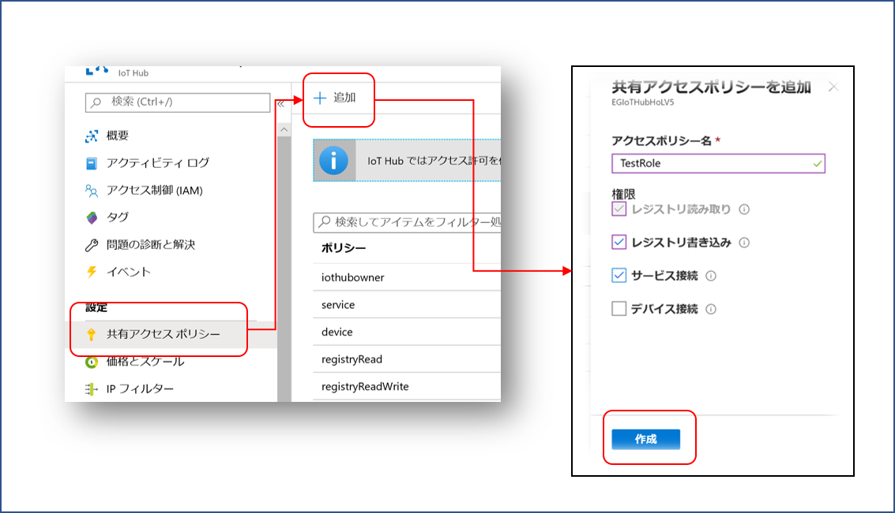

# AzureIoTHubDeviceMethodSampe
Azure IoT Hub の Direct Method 利用のサンプルコードとパフォーマンス計測環境。 
対象は、Device と IoT Edge Module の両方を対象。  
パフォーマンス計測時には、以下のパラメータを変化させ関連を調べることができる。
- 接続プロトコル
- Direct Method の名前の長さ
- Direct Method Invocation 時の Payload のデータ長
- Direct Method Invocation の応答時の データ長 
- 同時に複数の Invocation 
---
## 構成 
- service  
サービス側で、Direct Method を Invoke し、時間を計測するツール 
- device  
Direct Method を実行するデバイス（Azure IoT Device SDK 使用する小型デバイス向け）のエミュレータ
- edge  
Direct Method を実行する IoT Edge Module 版エミュレータ 
- utility  
Direct Method 機能を利用した、ちょっといけてるサンプル群


---
## セットアップ 
### 必要環境 
- VS Code と .NET Core が実行可能なパソコン（Windows、Mac、Linux可）、または、バーチャルマシン 
- VS Code 　- セットアップは[こちら](https://azure.microsoft.com/ja-jp/products/visual-studio-code/)を参照
- .NET Core SDK　- セットアップは[こちら](https://docs.microsoft.com/ja-jp/dotnet/core/sdk)を参照 
- VS Code C# Extension　- セットアップは[こちら](https://docs.microsoft.com/ja-jp/dotnet/core/tutorials/with-visual-studio-code)を参照
- Azure Subscription　(無料お試しでもOK) 　- 詳細は[こちら](https://azure.microsoft.com/ja-jp/free/)を参照 

### IoT 向けクラウドサービスの作成 
Azure IoT Hub が必要です。[こちら](https://docs.microsoft.com/ja-jp/azure/iot-hub/iot-hub-create-through-portal)を参照の上、Azure IoT Hub を一つ作成してください。既に作成済みの Azure IoT Hub がある場合は、それを使っても構いません。  
※ お試し可能なデータ長、同時 Invocation 数などに制約はありますが、スケールは Free でも構いません。 S1、S2、S3も当然利用可能です。リージョンの差を調べたい場合は、作成時に適切なリージョンを選んでください。 

---
## 使い方 
基本的な流れは以下の通り。　

1. Azure IoT Hub に IoT Device を必要なだけ登録し、各 Device 毎の接続も列を用意する。
2. Azure IoT Hub に service側のツール用に、ロールを作成し、その接続文字列を用意する。 
3. device ツールを、同時にテストしたいデバイスの数だけ、それぞれの接続文字列を使って実行する
4. テスト仕様を作成し、作成したロールの接続文字列を使って service ツールを実行する → 結果が得られる

作業を行う前に、本リポジトリを clone しておくこと。

### device  
ポータル上で、Azure IoT Hub に[こちら](https://docs.microsoft.com/ja-jp/azure/iot-hub/tutorial-routing#create-a-simulated-device)を参考に、必要な数だけデバイスを登録し、それぞれの接続文字列を取得する。Device Id は登録可能なら、なんでも構わない。  
作成したデバイスの数だけVS Code を起動し、[device フォルダー](./device)を開く。 
[launch.json](./device/.vscode/launch.json) を開き、 
```json
"args": ["--connection-string","<- connection string for device ->"],
```
の、<b><i><- connection string for device -></i></b>を、それぞれの接続文字列で書き換え、Debug 実行すれば動作が始まる。  
※ 本ツールは、.NET Core がインストールされているデバイスであれば実行可能である。VS Code を使用せず直接実行したい場合は、 
```shell
cd device
dotnet run --connection-string connection-string-for-device
```
で起動可能。  
※ <b><i>connection-string-for-device</i></b> は、摸したいデバイスの接続文字列に置き換えること。

本エミュレータは、起動すると、該当デバイスの Device Twins の Reported Propertyに以下のように値を追加し、このデバイスがテスト用であることを、 IoT Hub 上で通知する。 
```json
"reported": {
    "device-type": "method-invocation-test-device",
```
これにより、サービス側のserviceツールは、自動的にテスト用のデバイスを発見することも可能である。  
また、Direct Method Invocation 時に、応答を返すまでの時間と、応答用データ長を、Device Twins の Desired Property から取得する。
```json
"desired": {
    "firmware": {
        ...
    },
    "device-method-test": {
        "sleep-time": 1000,
        "response-data-length": 1000
    },
```
この値は、serviceツールによってパフォーマンス計測時に更新される。更新される度に、本エミュレータは更新通知を受け取り、都度、自身の設定に反映する。  

--- 
### service  
本アプリを実行するために、Azure IoT Hub の共有アクセスポリシーに以下の図のように新しくアクセスポリシーを作成する。

※ 本アプリは、Direct Method を Invoke するので、”サービス接続と”、Device Twinsを参照・更新するので、”レジストリ読み取り”、”レジストリ書き込み”の権限が必要  
作成した新しいポリシー（ここでは、<b><i>TestRole</i></b>)の接続文字列を、本アプリ起動時に使用する。 

VS Code で、[service フォルダー](./service) を開く。  
[launch.json](./service/.vscode/launch.json) を開き、作成した接続文字列で、<b><i><- connection string for registry read/write, service role -></i></b> を置き換える。  
[config.yml](./service/config.yml) を開き、パフォーマンスのテスト仕様を編集する。 

- test-loop-count  
 invoke する回数
- invocation-interval  
 invoke 間隔 - ミリセカンド単位
- device-id  
 テスト対象のデバイス群を明示的に示したい場合に定義する。Device Id リストを、yaml のリスト形式で書く
- device-type  
 ターゲットのデバイスエミュレータアプリは、Reported Property にマーキングするので、それを使って対象を指定したい場合に、利用する。値は、
    - method-invocation-test-device
- method-name  
　Direct Method の名前。 ※任意
- method-type  
　Direct Method の種別を指定。Device SDKを利用したデバイスエミュレータの場合は、"<b>device</b>"  を、Azure IoT Edge の Module を利用する場合は、"<b>module</b>" を指定する
- module-id  
　Module の Direct Method をテストする場合に指定する。規定値は、"<b>TestMethodModule</b>"
- data-size-of-payload  
 Invoke 時に送る Payload のデータ長（バイト数）
- sleep-msec-in-method  
 Direct Method 内での遅延時間。単位はミリセカンド。Desired Property を通じて、デバイスエミュレータに通知される
- data-size-of-response  
Direct Method 応答時に返すデータ長（バイト数）
- response-timeout  
 本アプリ内で Direct Method を Invoke した時の応答待ちのタイムアウト時間を指定する。単位はミリセカンド。sleep-msec-in-method に合わせて設定しないと、タイムアウトが発生し、失敗する。

 接続文字列とテスト仕様の編集が終わったら、VS Code で実行を開始する。
 参考までに、出力例を例示する。
 ```
Job Status : Queued
Job Status : Running
Job Status : Completed
[0]start:2020/05/01-12:51:23.988->end:2020/05/01-12:51:25.259 = 271.0540000000001
Sleeping fo next incocation - 5000
[1]start:2020/05/01-12:51:30.266->end:2020/05/01-12:51:31.439 = 173.25600000000009
Sleeping fo next incocation - 5000
[2]start:2020/05/01-12:51:36.453->end:2020/05/01-12:51:37.553 = 99.30999999999995
Sleeping fo next incocation - 5000
[3]start:2020/05/01-12:51:42.567->end:2020/05/01-12:51:43.703 = 136.29500000000007
Sleeping fo next incocation - 5000
[4]start:2020/05/01-12:51:48.716->end:2020/05/01-12:51:49.790 = 73.85300000000007
Sleeping fo next incocation - 5000
[5]start:2020/05/01-12:51:54.800->end:2020/05/01-12:51:55.889 = 89.32899999999995
Sleeping fo next incocation - 5000
[6]start:2020/05/01-12:52:00.907->end:2020/05/01-12:52:02.008 = 100.35699999999997
Sleeping fo next incocation - 5000
Sleeping fo next incocation - 5000
[8]start:2020/05/01-12:52:25.041->end:2020/05/01-12:52:26.132 = 91.91200000000003
Sleeping fo next incocation - 5000
[9]start:2020/05/01-12:52:31.150->end:2020/05/01-12:52:32.219 = 69.07199999999989
Sleeping fo next incocation - 5000
Statistics
Condition - InvokePayloadSize=1000,ResponseDataSize=1000,SleepInMethod=1000,InvokeInterval=5000
Total Incation Count - 10
Succeeded Count - 10
Mean:120.81690000000002,Median:99.83349999999996,PSD:57.8306345364635
```
最後に、Direct Method を Invoke した時点から、制御が戻ってきた時点までの時間差から、Direct Method 内での待ち時間を引いた値の統計情報（平均、中央値、標準偏差）が表示される。  
アプリ起動時、--log で指定されたファイルにも書き込まれる。  

---

### edge  
Under Construction


## Utility 
Under Construction